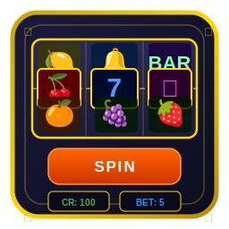
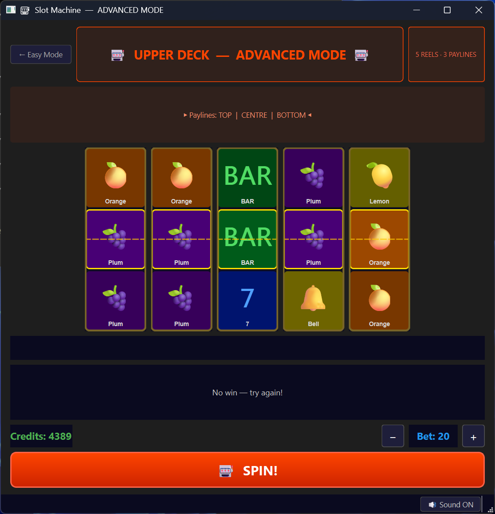
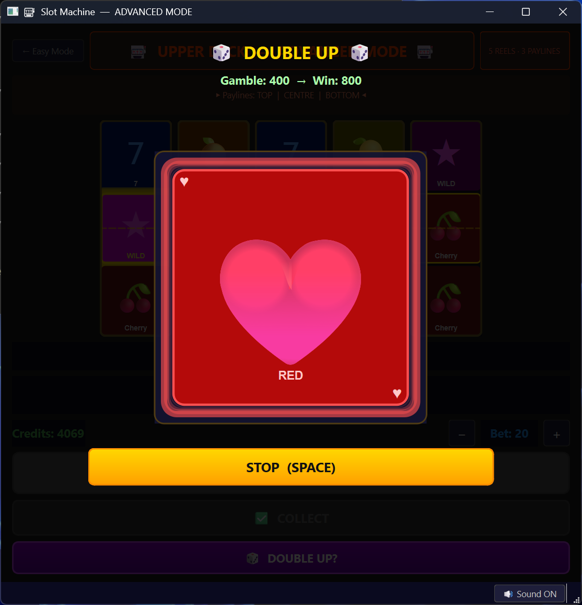

<div align="center">






# 🎰 Slot Machine
### v1.0 — OptimTeam

*A fully-featured, object-oriented slot machine simulation built with C++17 and Qt 6*


</div>

---

## 📋 Overview

A visually rich slot machine game with two distinct game modes, realistic reel animations, procedurally synthesised sound effects, and a Double Up gamble feature — all built without any external asset files.

---

## ⬇️ Download & Install

### Windows — Pre-built Installer

> No build tools required — just download, extract and run.

**[⬇️ Download SlotMachine.zip for Windows](https://dit.uoi.gr/files/SlotMachine.zip)**

1. Download and extract `SlotMachine.zip`
2. Run `SlotMachine.exe`
3. If Windows Defender prompts, click **More info → Run anyway**

> **Note:** Requires the [Visual C++ Redistributable 2022](https://aka.ms/vs/17/release/vc_redist.x64.exe) (usually already installed).

---

## ✨ Features

### 🎮 Two Game Modes

| Mode | Reels | Paylines | Access |
|------|-------|----------|--------|
| **Easy** (Lower Screen) | 3 | 1 (centre) | Default |
| **Advanced** (Upper Screen) | 5 | 3 (top, centre, bottom) | After 20 spins |

### 🎰 Reel Mechanics
- **12 unique symbols** with individual appearance probabilities
- **Realistic weighted strip** (64 stops per reel, shuffled at startup)
- **Mechanical scroll animation** — symbols slide top→bottom at 60fps, decelerate naturally and snap to correct position
- **Chain-locked stopping** — reels stop sequentially left→right, each waiting for the previous to fully lock
- **Win highlights** — winning symbols pulse with a golden glow

### 🃏 Symbol Set

| Symbol | Display | Rarity |
|--------|---------|--------|
| 🍒 Cherry | Emoji | Very common (14.3%) |
| 🍋 Lemon | Emoji | Very common (12.9%) |
| 🍊 Orange | Emoji | Common (11.4%) |
| 🍉 Watermelon | Emoji | Common (10.0%) |
| 🍇 Grape | Emoji | Medium (8.6%) |
| 🍓 Strawberry | Emoji | Medium (7.1%) |
| 🔔 Bell | Emoji | Medium (10.0%) |
| BAR | Text | Uncommon (7.1%) |
| BAR BAR | Text (2-line) | Rare (4.3%) |
| BAR BAR BAR | Text (3-line) | Very rare (2.9%) |
| 7 | Text | Rare (4.3%) |
| ★ Wild | Text | Rare (4.3%) — matches any symbol |

### 🎲 Double Up (Gamble Feature)
After any win, a **DOUBLE UP** button appears:
- Animated red/black card cycling display
- Press **STOP** or **SPACE** → 50/50 result
- **Win** → credits × 2, option to gamble again
- **Lose** → pending win is lost
- **Collect** → triggers count-up animation, credits accumulate with coin sound

### 🔊 Procedural Audio
All sounds are synthesised at runtime from sine waves, noise, and frequency modulation — **no audio files required**:

| Event | Sound |
|-------|-------|
| Spin button | Short click |
| Reel spinning | Whirring loop |
| Reel lock | Mechanical thud |
| Small win | C major arpeggio |
| Big win | Extended arpeggio + chord |
| Jackpot | Full fanfare + trill |
| Collect credits | Coin clink loop |
| Double Up win | Win fanfare |
| Double Up lose | Deep descending tone |
| Level up | Rising sweep |

---

## 🏗️ Architecture

The project follows strict OOP design with separate files per class:

```
SlotMachine/
├── core/                      # Game logic (no UI dependencies)
│   ├── Symbol.h / .cpp        # Symbol enum + data (emoji, value, rarity)
│   ├── Reel.h / .cpp          # Circular strip, spin(), weighted symbols
│   ├── PayTable.h / .cpp      # Win evaluation for 3-reel and 5-reel modes
│   ├── GameState.h / .cpp     # Credits, bet, level, signals
│   ├── SlotMachine.h / .cpp   # Orchestrator — Reel + PayTable + GameState
│   └── SoundEngine.h / .cpp   # Procedural PCM audio (push-mode QAudioSink)
│
├── ui/                        # Qt Widgets (depend on core)
│   ├── ReelWidget.h / .cpp    # Animated reel with scroll physics + highlights
│   ├── LowerScreen.h / .cpp   # Easy mode screen (3 reels)
│   ├── UpperScreen.h / .cpp   # Advanced mode screen (5 reels)
│   ├── DoubleUpWidget.h / .cpp # Gamble overlay (card animation)
│   └── MainWindow.h / .cpp    # QStackedWidget host, credit transfer
│
├── main.cpp
├── CMakeLists.txt
├── SlotMachine.ico            # Application icon (Windows)
└── README.md
```

### Core Data Flow

```
GameState ←──── credits, bet, level signals ────→ UI Labels
    ↑
SlotMachine::spin()
    ├── Reel::spin() × N          (randomise stop position)
    ├── PayTable::evaluate()      (check winning combinations)
    └── pendingWin stored         (NOT added to credits yet)
                ↓
        User presses COLLECT
                ↓
        Count-up animation (25ms ticks)
        collectPendingWin(step) × N  → GameState::setCredits()
```

---

## 🔧 Build Requirements

| Dependency | Windows | Linux |
|------------|---------|-------|
| C++ Compiler | MSVC 2022 (v19.4+) | GCC 11+ or Clang 14+ |
| CMake | 3.16+ | 3.16+ |
| Qt | 6.x (Widgets + Multimedia) | 6.x (Widgets + Multimedia) |

---

## 🚀 Build Instructions

### 🪟 Windows (Visual Studio 2022)

```powershell
cd SlotMachine

# Configure (adjust Qt path as needed)
cmake -S . -B build `
  -G "Visual Studio 17 2022" -A x64 `
  "-DCMAKE_PREFIX_PATH=C:\Qt\6.10.1\msvc2022_64"

# Build
cmake --build build --config Release

# Run
.\build\Release\SlotMachine.exe
```

### 🐧 Linux (GCC / Clang)

**Install dependencies (Ubuntu / Debian):**
```bash
sudo apt update
sudo apt install -y \
  build-essential cmake \
  qt6-base-dev qt6-multimedia-dev \
  libgl1-mesa-dev
```

**Build & Run:**
```bash
cd SlotMachine

cmake -S . -B build \
  -DCMAKE_BUILD_TYPE=Release

cmake --build build -j$(nproc)

./build/SlotMachine
```

> **Qt not found?** Specify the path manually:
> ```bash
> cmake -S . -B build \
>   -DCMAKE_BUILD_TYPE=Release \
>   -DCMAKE_PREFIX_PATH=/path/to/Qt/6.x.x/gcc_64
> ```

---

## 🎮 How to Play

1. **Set your bet** with the `−` / `+` buttons (min 1, max 20)
2. Press **SPIN** — reels animate and stop left→right
3. **On a win:**
   - Winning symbols glow gold
   - Win amount shown below reels
   - Choose **COLLECT** to bank credits (with count-up animation)
   - Or **DOUBLE UP** to risk it all for 2×
4. **SPIN is locked** until you Collect or the Double Up resolves
5. After **20 spins** on Easy, the **Advanced Mode** unlocks (5 reels, 3 paylines, bigger wins)
6. Switch freely between modes — credits carry over
7. Toggle **🔊 Sound ON / 🔇 Muted** in the status bar

---

## 📊 Win Tables

### Easy Mode (3 Reels, 1 Payline)

| Combination | Multiplier |
|-------------|-----------|
| ★ ★ ★ Wild | ×1000 |
| 7 7 7 | ×200 |
| 3BAR 3BAR 3BAR | ×100 |
| 2BAR 2BAR 2BAR | ×60 |
| BAR BAR BAR | ×30 |
| 🔔 🔔 🔔 | ×20 |
| 🍓 🍓 🍓 | ×12 |
| 🍇 🍇 🍇 | ×10 |
| 🍉 🍉 🍉 | ×8 |
| 🍊 🍊 🍊 | ×6 |
| 🍋 🍋 🍋 | ×4 |
| 🍒 🍒 🍒 | ×3 |
| 🍒 🍒 any | ×2 |

### Advanced Mode (5 Reels, up to 3 Paylines)
Multipliers up to **×5000** across 3 independent paylines — wins are summed when multiple lines hit simultaneously.

---

## 🧩 Technical Highlights

- **Procedural audio engine** using Qt6 push-mode `QAudioSink` — single OS audio thread, zero file I/O
- **Pre-planned reel stop queue** guarantees correct final symbols without visual snapping
- **Signal-chained reel stops** — each reel emits `stopped()` to trigger the next, ensuring perfect sequential locking
- **Pending win system** — credits are never added automatically; always require explicit player action (Collect or Double Up), matching real casino behaviour
- **`WIN32` subsystem** (Windows) — no console window when launched

---

## 👥 Team

**OptimTeam** — v1.0

---

<div align="center">
<i>Built with ❤️ using C++17 and Qt 6</i>
</div>
