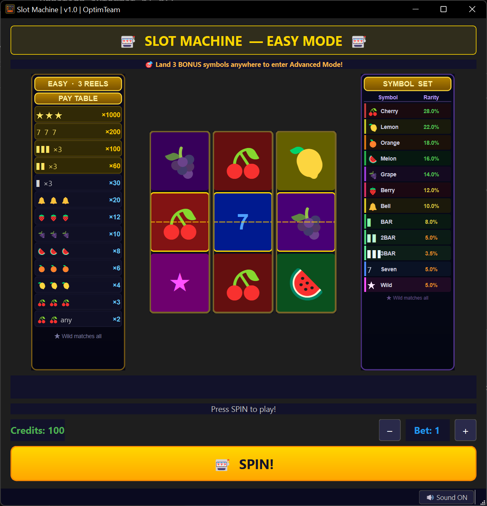
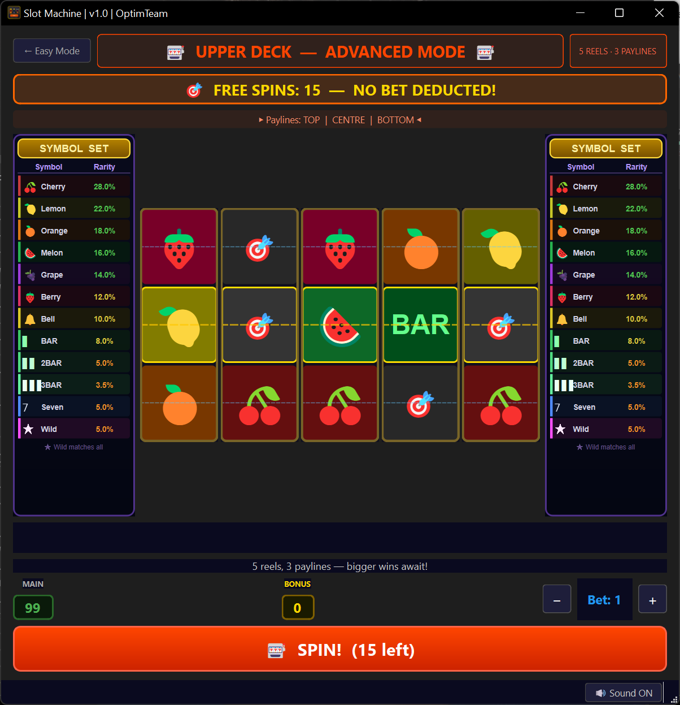

<div align="center">



<br>


# 🎰 Slot Machine
### v1.0 - OptimTeam

*A fully-featured, object-oriented slot machine simulation built with C++17 and Qt 6*


</div>

---

## 📋 Overview

A visually rich slot machine game inspired by the classic **Reel Magic** casino cabinet, featuring two distinct game modes, realistic mechanical reel animations, procedurally synthesised sound effects, a Double Up gamble feature, and a fully configurable symbol rarity system - all built without any external asset files.

---

## ⬇️ Download & Install

### Windows - Pre-built Installer

> No build tools required - just download, extract and run.

**[⬇️ Download SlotMachine.zip for Windows](https://dit.uoi.gr/files/SlotMachine.zip)**

1. Download and extract `SlotMachine.zip`
2. Run `SlotMachine.exe`
3. If Windows Defender prompts, click **More info → Run anyway**

> **Note:** Requires the [Visual C++ Redistributable 2022](https://aka.ms/vs/17/release/vc_redist.x64.exe) (usually already installed).

---

## ✨ Features

### 🎮 Two Game Modes - Reel Magic Style

| Mode | Screen | Reels | Paylines | Access |
|------|--------|-------|----------|--------|
| **Easy** | Lower | 3 | 1 (centre) | Default |
| **Advanced** | Upper | 5 | 3 (top, centre, bottom) | Bonus trigger |

**How to enter Advanced Mode:**
Land **3 or more 🎯 BONUS symbols anywhere** on the lower screen reels (scatter - no need to be on the payline). This awards **15 Free Spins** on the upper screen.

**Advanced Mode mechanics:**
- Upper screen has its own **BONUS credits** counter (starts at 0)
- **MAIN credits** are displayed read-only (frozen during bonus)
- Free spins are completely free - no bet deducted
- Remaining spins shown on the SPIN button: `🎰 SPIN! (12 left)`
- When free spins are exhausted: bonus credits are **added to main credits** with a count-up animation and coin sound

### 🎰 Reel Mechanics
- **13 unique symbols** with configurable appearance probabilities
- **Realistic weighted strip** (shuffled at startup for natural randomness)
- **Mechanical scroll animation** at 60fps - symbols slide top→bottom, decelerate and snap precisely
- **Chain-locked stopping** - reels lock sequentially left→right; each reel waits for the previous to fully stop before decelerating
- **Synchronised sound** - thud plays exactly when each reel locks, not when deceleration begins
- **Win highlights** - winning symbols pulse with a golden glow for each winning payline

### 🃏 Symbol Set

| Symbol | Display | Default Rarity | Notes |
|--------|---------|---------------|-------|
| 🍒 Cherry | Emoji | 28.0% | Most common; 2× pays ×2 |
| 🍋 Lemon | Emoji | 22.0% | |
| 🍊 Orange | Emoji | 18.0% | |
| 🍉 Watermelon | Emoji | 16.0% | |
| 🍇 Grape | Emoji | 14.0% | |
| 🍓 Strawberry | Emoji | 12.0% | |
| 🔔 Bell | Emoji | 10.0% | |
| BAR | Text | 8.0% | |
| BAR BAR | Text (2-line) | 5.0% | |
| BAR BAR BAR | Text (3-line) | 3.5% | |
| 7 | Text | 5.0% | ×200 in Easy |
| ★ Wild | Text | 5.0% | Matches any symbol |
| 🎯 Bonus | Emoji | 8.0% | **Easy only** - scatter trigger |

> Rarity values are fully configurable via `rarity.cfg` - no rebuild required.

### 🎯 Bonus Round (Reel Magic Style)
- **3+ Bonus scatters** anywhere on Easy screen → triggers Advanced Mode
- 2-second animated announcement before switching screens
- Upper screen: 15 free spins, own bonus credit counter
- Return to Easy: bonus credits added gradually with coin sound

### 🃏 Double Up (Gamble Feature)
After any win, **SPIN is locked** and two buttons appear:
- **✅ COLLECT** → count-up animation (credits increase gradually with coin sound)
- **🎲 DOUBLE UP** → card cycling overlay (fan/turbine sound)
  - Press **STOP** or **SPACE** → 50/50 red/black result
  - Win → amount ×2, offer to gamble again or collect
  - Lose → pending win is lost
  - Collect after win → count-up animation as usual

### 🔊 Procedural Audio Engine
All sounds generated at runtime - **no audio files required**:

| Event | Sound |
|-------|-------|
| Spin button | Short click (880Hz) |
| Reel spinning | Whirring loop (blade-pass modulated) |
| Reel lock | Mechanical thud (noise + low tone) |
| Small win | C major arpeggio |
| Big win | Extended arpeggio + chord |
| Jackpot | Full fanfare + trill |
| Collect / Bonus added | Coin clink loop |
| Double Up cycling | Fan/turbine flutter sound |
| Double Up win | Win fanfare |
| Double Up lose | Deep descending tone |
| Bonus round entry | Rising octave sweep |

Single `QAudioSink` in push mode - one OS audio thread, no pops or glitches.

### 📊 Side Panels
- **Left panel** - Pay Table for the current mode (Easy: 3-reel, Advanced: Win rates)
- **Right panel** - Symbol Set with rarity percentages (colour-coded: green=common, yellow=medium, orange/red=rare)

---

## 🏗️ Architecture

```
SlotMachine/
├── core/                        # Game logic (no UI dependencies)
│   ├── Symbol.h / .cpp          # 13 symbols: emoji, text, value, isText flag
│   ├── Reel.h / .cpp            # Weighted strip (from rarity.cfg), shuffled
│   ├── PayTable.h / .cpp        # 3-reel (1 payline) + 5-reel (3 paylines)
│   ├── GameState.h / .cpp       # Credits, bet, free spins, bonus round
│   ├── SlotMachine.h / .cpp     # Orchestrator; bonusTriggered(), pendingWin()
│   ├── SoundEngine.h / .cpp     # Procedural PCM (push-mode QAudioSink)
│   └── RarityConfig.h / .cpp    # Singleton: loads rarity.cfg at startup
│
├── ui/                          # Qt Widgets
│   ├── ReelWidget.h / .cpp      # Scroll physics, chain-stop signal, highlights
│   ├── WinTableWidget.h / .cpp  # Pay table + Symbol Set side panels
│   ├── LowerScreen.h / .cpp     # Easy mode (3 reels, bonus scatter detection)
│   ├── UpperScreen.h / .cpp     # Advanced mode (5 reels, free spins counter)
│   ├── DoubleUpWidget.h / .cpp  # Card-cycling gamble overlay
│   └── MainWindow.h / .cpp      # QStackedWidget; bonus count-up on return
│
├── main.cpp
├── CMakeLists.txt
├── rarity.cfg                   # ← Edit this to tune symbol probabilities
├── SlotMachine.ico              # Application icon (Windows)
└── README.md
```

### Core Data Flow

```
GameState ──── signals ────────────────────────────────→ UI Labels
    ↑
SlotMachine::spin()
    ├── Reel::spin() × N              (pick random stop from weighted strip)
    ├── PayTable::evaluate()          (check all paylines)
    ├── bonusTriggered detection      (3+ Bonus scatters anywhere)
    └── pendingWin stored             (NOT added to credits yet)
                ↓
    Player presses COLLECT
                ↓
    Count-up animation (25ms ticks) → collectPendingWin(step)

Bonus trigger:
    LowerScreen detects bonusTriggered()
    → triggerBonusRound()             (awards 15 free spins)
    → 2s delay → MainWindow::switchToAdvanced()
    → UpperScreen refreshDisplay()    (spin enabled, counter shown)
    → Each free spin: consumeFreeSpin()
    → freeSpinsLeft() == 0 → finishRound() → backRequested()
    → MainWindow::switchToEasy()
    → bonus credits count-up → easyMachine credits
```

---

## ⚙️ Configuration - rarity.cfg

The `rarity.cfg` file sits next to the executable and controls symbol probabilities:

```ini
# Slot Machine - Symbol Rarity Configuration
# Percentages are relative weights (do not need to sum to 100).
# Edit freely - changes take effect on next launch.

Cherry     = 28.0    # most common
Lemon      = 22.0
Orange     = 18.0
Watermelon = 16.0
Grape      = 14.0
Strawberry = 12.0
Bell       = 10.0
Bar        =  8.0
Bar2       =  5.0
Bar3       =  3.5
Seven      =  5.0
Wild       =  5.0
Bonus      =  8.0    # scatter - Easy mode only
```

**Rules:**
- Set a value to `0` to completely exclude a symbol
- Higher values = more frequent appearances
- The `Bonus` symbol only appears in Easy mode (3-reel); Advanced (5-reel) strips automatically exclude it
- Changes take effect on next launch - no rebuild needed

---

## 🔧 Build Requirements

| Dependency | Windows | Linux |
|------------|---------|-------|
| C++ Compiler | MSVC 2022 (v19.4+) | GCC 11+ or Clang 14+ |
| CMake | 3.16+ | 3.16+ |
| Qt | 6.x (Widgets + Multimedia) | 6.x (Widgets + Multimedia) |

---

## 🚀 Build Instructions

### 🪟 Windows (Visual Studio 2022)

```powershell
cd SlotMachine

cmake -S . -B build `
  -G "Visual Studio 17 2022" -A x64 `
  "-DCMAKE_PREFIX_PATH=C:\Qt\6.10.1\msvc2022_64"

cmake --build build --config Release

.\build\Release\SlotMachine.exe
```

> The build system automatically copies `rarity.cfg` next to the executable.

### 🐧 Linux (GCC / Clang)

**Ubuntu / Debian:**
```bash
sudo apt update && sudo apt install -y \
  build-essential cmake \
  qt6-base-dev qt6-multimedia-dev libgl1-mesa-dev
```

**Build & Run:**
```bash
cd SlotMachine
cmake -S . -B build -DCMAKE_BUILD_TYPE=Release
cmake --build build -j$(nproc)
cp rarity.cfg build/
./build/SlotMachine
```

---

## 🎮 How to Play

### Easy Mode (Lower Screen)
1. Set your **bet** with `−` / `+` (min 1, max 20)
2. Press **SPIN**
3. **Win** → WIN label appears + **COLLECT** and **DOUBLE UP** buttons
   - **COLLECT** → credits count up gradually with coin sound; SPIN re-enables
   - **DOUBLE UP** → risk your win for ×2 (press SPACE or STOP)
4. **SPIN stays locked** until you Collect or resolve the Double Up
5. Land **3+ 🎯 BONUS** anywhere → enter Advanced Mode bonus round

### Advanced Mode (Upper Screen - Bonus Round)
1. **Free spins** are played automatically - no bet deducted
2. SPIN button shows remaining count: `🎰 SPIN! (14 left)`
3. Wins are added to **BONUS** counter (separate from main credits)
4. When free spins run out → "BONUS WON: X credits!" → returns to Easy Mode
5. Bonus credits are **added to main credits** with count-up animation

### Double Up
- After any win: press **🎲 DOUBLE UP**
- Cards cycle slowly (fan sound) - press **STOP** or **SPACE** at any time
- **Red card** = Win (×2), **Black card** = Win (×2) - purely 50/50
- Win → option to Double Again or Collect
- Lose → pending win lost, SPIN re-enables

### Tips
- Toggle **🔊 / 🔇** in the status bar to mute all sounds
- Increase `Bonus` in `rarity.cfg` to trigger Advanced Mode more often
- Wild (★) substitutes for any symbol in winning combinations

---

## 📊 Pay Tables

### Easy Mode (3 Reels, 1 Payline)

| Combination | Multiplier |
|-------------|-----------|
| ★ ★ ★ Wild | ×1000 |
| 7 7 7 | ×200 |
| 3BAR 3BAR 3BAR | ×100 |
| 2BAR 2BAR 2BAR | ×60 |
| BAR BAR BAR | ×30 |
| 🔔 🔔 🔔 | ×20 |
| 🍓 🍓 🍓 | ×12 |
| 🍇 🍇 🍇 | ×10 |
| 🍉 🍉 🍉 | ×8 |
| 🍊 🍊 🍊 | ×6 |
| 🍋 🍋 🍋 | ×4 |
| 🍒 🍒 🍒 | ×3 |
| 🍒 🍒 any | ×2 |

### Advanced Mode (5 Reels, 3 Paylines)

| Combination | Multiplier |
|-------------|-----------|
| ★×5 | ×5000 |
| 7×5 | ×1000 |
| 7×4 | ×300 |
| 7×3 | ×100 |
| 3BAR×5 | ×500 |
| 3BAR×3–4 | ×80–200 |
| 2BAR×3–5 | ×50–300 |
| BAR×3–5 | ×25–150 |
| 🔔×3–5 | ×15–100 |
| Fruit×3–5 | ×3–70 |
| 🍒🍒 any | ×2 |

> Wins from multiple paylines are summed automatically.

---

## 👥 Team

**OptimTeam** - v1.1

---

<div align="center">
<i>Built with ❤️ using C++17 and Qt 6 - inspired by Reel Magic casino cabinets</i>
</div>
